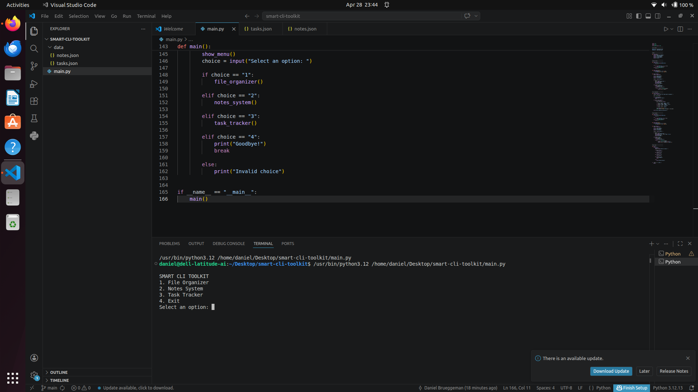

🧠 Smart CLI Toolkit

## 📸 Demo

A Python-based command-line productivity and automation toolkit built to demonstrate foundational software engineering skills through practical, real-world utilities.

🎯 Purpose

This project was built as part of an early-stage software engineering learning path focused on:

Writing structured, modular Python applications
Working with persistent data storage (JSON)
Automating simple system-level tasks
Building CLI-based tools with real utility

⚙️ Features

📝 Notes System
Add and view notes
Persistent storage using JSON files
Data retained between sessions

✅ Task Tracker
Add and view tasks
Structured task storage with status tracking
Expandable foundation for productivity systems

📂 File Organizer
Automatically organizes files by type
Separates Images, Documents, and Others
Uses Python filesystem automation (os, shutil, pathlib)

🛠️ Technologies Used
Python 3
JSON for data persistence
os module (file system interaction)
shutil (file operations)
pathlib (modern path handling)

📚 Key Learning Outcomes
Building modular CLI applications in Python
Implementing persistent data storage systems
Handling file system automation safely
Structuring multi-feature programs
Practicing real-world problem decomposition
